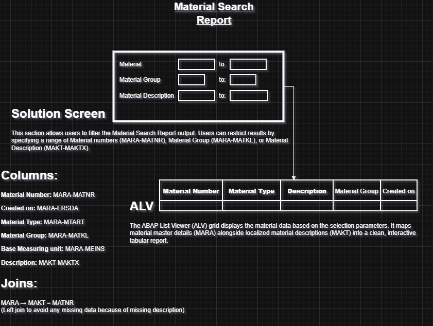

# Material Search Report

A SAP ABAP report (`Z_MATERIAL_SEARCH`) that lets a user search materials by material number, material group, and material description, then displays the results — material number, type, description, group, base unit of measure, and creation date — in an ABAP List Viewer (ALV) grid.



## Overview

The report reads material master data from `MARA` and left-joins the material description from `MAKT` (in English, `SPRAS = 'E'`). Results are rendered with `REUSE_ALV_GRID_DISPLAY` for an interactive, sortable grid. Custom messages from message class `ZSD` are raised depending on the selection outcome.

**Tables used**

| Table  | Purpose                                        |
|--------|-------------------------------------------------|
| `MARA` | Material master (number, type, group, unit, creation date) |
| `MAKT` | Material descriptions (by language)            |

**Join**

```
MARA → MAKT  on MATNR  (left join, so materials without a description still appear)
```

## Selection Screen

The selection screen lets the user filter the report by:

- **Material** (range) — `MARA-MATNR`
- **Material Group** (range) — `MARA-MATKL`
- **Material description** (range) — `MAKT-MAKTX`


## Report Output (ALV)

Once executed, the report displays the following columns in an ALV grid:

| Column               | Field         |
|-----------------------|--------------|
| Material Number         | `MARA-MATNR` |
| Material Type           | `MARA-MTART` |
| Description              | `MAKT-MAKTX` |
| Material Group           | `MARA-MATKL` |
| Base Measuring unit      | `MARA-MEINS` |
| Created on                | `MARA-ERSDA` |

If no records are found, or the selection returns an error, the report raises the corresponding message from message class `ZSD` (`E001`/`E002`/`E003`) instead of displaying an empty grid.


## Design / Diagram

The `Diagrams` folder contains the design notes used while building the report, mapping each screen field and ALV column to its underlying data element, plus the join logic between `MARA` and `MAKT`.

- [`MSR_Diagram.jpg`](Diagrams/MSR_Diagram.jpg) — clean version of the design (shown above)
- [`MSR_Diagram.drawio`](Diagrams/MSR_Diagram.drawio) — editable draw.io source

## Project Structure

```
Material_Search_Report/
├── Src/
│   ├── Z_MATERIAL_SEARCH.abap     # Report source code
│   └── Text_Element.xlsx          # Text Symbols & Selection Texts
├── Screenshots/
│   ├── Selection screen.png       # Selection screen at runtime
│   └── Alv Display.png            # ALV grid output
├── Diagrams/
│   ├── MSR_Diagram.jpg            # Design diagram (clean)
│   └── MSR_Diagram.drawio         # Design diagram (editable source)
└── README.md
```

## How to Use

1. Open your SAP system in Eclipse ADT or the SAP GUI (`SE38`/`SE80`).
2. Create a new executable report named `Z_MATERIAL_SEARCH` (or any Z-name of your choosing).
3. Copy the code from [`Src/Z_MATERIAL_SEARCH.abap`](Src/Z_MATERIAL_SEARCH.abap) into the report.
4. Go to "Text Element" in the same menu.
5. Fill in Text Symbols and Selection Texts from [`Src/Text_Element.xlsx`](Src/Text_Element.xlsx).
6. Activate the text elements separately.
7. Make sure message class `ZSD` exists (`SE91`) with messages `001`, `002`, and `003` maintained, since the report raises these on error.
8. Activate the report.
9. Run it (`F8`), enter optional filters on the selection screen, and execute to view the ALV output.

## Author

Created by **Moaz Khaled & Yousef Waleed**
